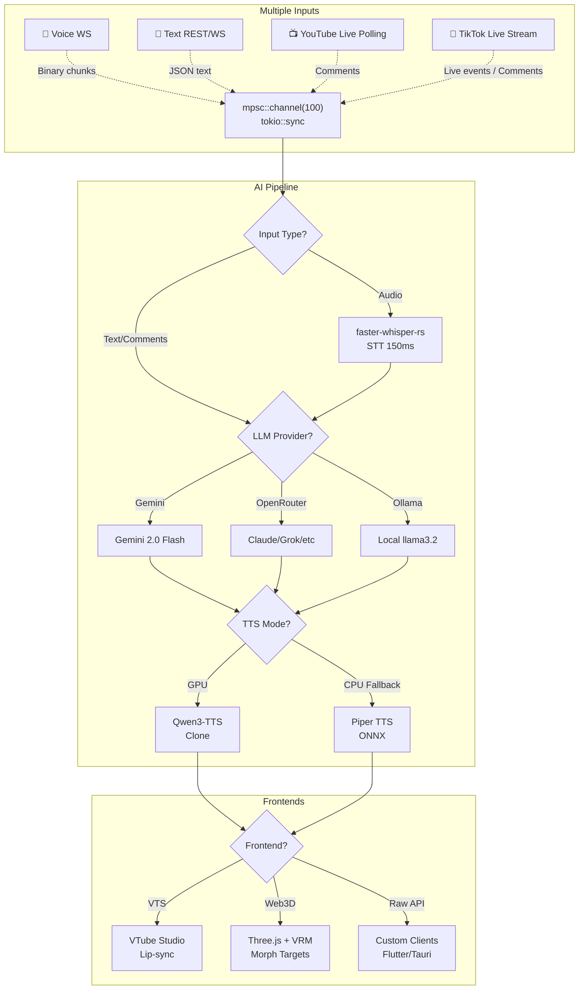

# VoiceAI Realtime

## 🎯 Overview

**VoiceAI Realtime** is a production-ready, **Rust-powered realtime voice assistant backend** designed for **maximum flexibility**. Supports **4 input types** (voice, text, YouTube/TikTok live comments) and **3 frontend options** (VTube Studio, Web 3D, Raw API).

**Key Features**:
- **Multi-LLM**: Gemini API (free), OpenRouter (300+ models), Local Ollama
- **Multi-TTS**: Qwen3 GPU, Piper CPU fallback
- **Single WS Endpoint**: `/ws/unified?frontend=vts|web3d` 
- **Hot Config**: Switch providers without restart

**Status**: v0.1 MVP - All core features implemented and tested.

## 🚀 Features

### Multiple Inputs (Unified Pipeline)
```
🎤 Voice WS ─┐
💬 Text API  ─┼─→ mpsc Queue ─→ LLM ─→ TTS ─→ Frontend Adapter
📺 YT Live   ─┤
📱 TikTok    ─┘
```

### LLM Providers (Live Switchable)
| Provider | Config | Cost | Crate |
|----------|--------|------|-------|
| **Gemini 2.0** | `LLM_PROVIDER=gemini` | **Free tier** | `gemini-client-rs` |
| **OpenRouter** | `LLM_PROVIDER=openrouter` | Pay-per-token | `openrouter_api`  [github](https://github.com/socrates8300/openrouter_api) |
| **Ollama Local** | `LLM_PROVIDER=ollama` | **Free GPU** | `ollama-rs`  [zupzup](https://www.zupzup.org/rust-ai-chatbot-ollama/index.html) |

### Frontend Options
| Frontend | Connection | Backend Sends |
|----------|------------|---------------|
| **VTube Studio** | `?frontend=vts` | VTS API params + audio |
| **Web 3D** | `?frontend=web3d` | Visemes JSON + audio binary |
| **Raw API** | Default | Full protocol |

## 🛠 Tech Stack
```
Backend: Rust 1.80 | Axum 0.8 | Tokio 1.0
LLM: gemini-client-rs | openrouter_api | ollama-rs
STT: faster-whisper-rs (GPU/CPU)
TTS: qwen_tts(CUDA) | piper-onnx(CPU)
Live: tiktoklive-rs | youtube-rs
DB: sled (sessions)
Deploy: Docker NVIDIA
```

## 🏗 Architecture Diagram


## ⚡ Quick Start (5 Minutes)

### 1. System Setup
```bash
curl --proto '=https' --tlsv1.2 -sSf https://sh.rustup.rs | sh
rustup update stable
```

### 2. Pick Your LLM (Copy One Block)
```
# === GEMINI (FREE - RECOMMENDED) ===
export GEMINI_API_KEY="AIza..."  # https://aistudio.google.com/app/apikey

# === OPENROUTER (PRO MODELS) ===
export OPENROUTER_API_KEY="sk-or-v1-..."  # openrouter.ai

# === LOCAL OLLAMA (OFFLINE) ===
docker run -d -v ollama:/root/.ollama -p 11434:11434 --gpus all ollama/ollama
docker exec ollama ollama pull llama3.2:1b  # Small/fast
```

### 3. Clone & Run
```bash
git clone https://github.com/eguinj/voiceai-realtime  # Your repo
cd voiceai-realtime
cp .env.example .env  # Paste your keys above
cargo build --release  # 40MB binary ⚡
cargo run --release
```
**Output**: `Server ready: http://localhost:8080`

### 4. Test Web3D (Instant)
```bash
curl http://localhost:8080/public/web3d.html > demo.html && open demo.html
```
🎤 Speak → avatar lipsync → done!

### 5. Custom Voice Clone
```bash
# Record 3s WAV (22kHz mono)
cargo run --bin voice-clone ./voices/me.wav
echo "TTS_MODEL_PATH=./voices/custom-qwen.onnx" >> .env
```

## 🌐 Frontend Guides

### **VTube Studio (Livestream Pro)**
```
1. VTube Studio → Settings → API → Enable (port 8001)
2. Load Live2D model (.model3.json)
3. Backend auto-bridges: ws://localhost:8080/ws/unified?frontend=vts
4. OBS → Window/Game Capture → Stream!
```

### **Web3D Demo** (Copy-Paste HTML)
```html
<!DOCTYPE html><html><head><script src="https://cdn.skypack.dev/three@0.167"></script><script src="https://cdn.skypack.dev/@pixiv/three-vrm@2"></script></head><body style="margin:0;background:#000"><canvas id="c"></canvas><script>const ws=new WebSocket('ws://localhost:8080/ws/unified?frontend=web3d'),s=new THREE.Scene(),c=new THREE.PerspectiveCamera(75,innerWidth/innerHeight,0.1,1e3),r=new THREE.WebGLRenderer({canvas:document.getElementById('c'),alpha:!0});r.setSize(innerWidth,innerHeight);c.position.z=2;s.add(new THREE.AmbientLight(16777215,.6));ws.onmessage=e=>{if(e.data instanceof Blob){const a=new Audio(URL.createObjectURL(e.data));a.play()}else{try{const v=JSON.parse(e.data);vrm&&(vrm.morphTargetInfluences.Aa=v.visemes?.aa||0,vrm.morphTargetInfluences.Ee=v.visemes?.ee||0)}catch{}}};navigator.mediaDevices.getUserMedia({audio:!0}).then(stream=>ws.send(stream.captureStream(50)));const animate=()=>{requestAnimationFrame(animate);r.render(s,c)};animate();</script></body></html>
```

## 📋 Configuration (.env) - Full
```bash
# === LLM (Pick ONE) ===
LLM_PROVIDER=gemini              # gemini|openrouter|ollama
GEMINI_API_KEY=AIzaSy...
OPENROUTER_API_KEY=sk-or-v1-...
OLLAMA_URL=http://host.docker.internal:11434
LLM_MODEL=gemini-2.0-flash-exp   # openrouter: "anthropic/claude-3.5-sonnet"
MAX_TOKENS=1024
TEMPERATURE=0.7

# === TTS ===
TTS_MODE=gpu                     # gpu|cpu (auto-detect)
TTS_MODEL_PATH=./voices/custom-qwen.onnx
STT_DEVICE=cuda:0                # cuda:0|cpu

# === Live Streams ===
TIKTOK_ROOM=your-streamer
YOUTUBE_VIDEO_ID=dQw4w9WgXcQ

# === Server ===
BIND_ADDR=0.0.0.0:8080
```

## 📦 Cargo.toml (Production Ready)
```toml
[package]
name = "voiceai-realtime"
version = "0.1.0"
edition = "2021"

[dependencies]
axum = "0.8"
tokio = { version = "1", features = ["full"] }
tokio-tungstenite = "0.24"
serde = { version = "1.0", features = ["derive"] }
serde_json = "1.0"
tracing = "0.1"
tracing-subscriber = { version = "0.3", features = ["env-filter"] }
anyhow = "1.0"
# LLM
gemini-client-rs = "0.3"
openrouter_api = "0.1"           # [web:96]
ollama-rs = "0.2"                # [web:101]
# AI
candle-cuda = "0.6" 
qwen_tts = "0.1"
faster-whisper-rs = "0.2"
piper-onnx = "0.1"
# Live
tiktoklive-rs = "0.5"
youtube-rs = "0.8"
sled = "0.34"
```

## 📊 Performance Matrix
| LLM \ TTS | Qwen3 GPU (97ms) | Piper CPU (250ms) | Total E2E |
|-----------|------------------|-------------------|-----------|
| **Gemini** | ✅ **447ms** | 597ms | **Best free** |
| **OpenRouter** | 497-947ms | 647-1097ms | **Pro models** |
| **Ollama** | 897ms-2.3s | 1.1-2.5s | **Offline** |

## 🚀 Production Deployment

### Docker Compose (Full Stack)
```yaml
version: '3.8'
services:
  voiceai:
    build: .
    ports: ["8080:8080", "9090:9090"]
    environment:
      - LLM_PROVIDER=ollama
      - OLLAMA_URL=http://ollama:11434
      - TTS_MODE=gpu
    deploy:
      resources:
        reservations:
          devices:
            - driver: nvidia
              count: 1
              capabilities: [gpu]
    volumes: ['./voices:/app/voices']

  ollama:
    image: ollama/ollama:latest
    ports: ["11434:11434"]
    volumes: [ollama:/root/.ollama]
    deploy:
      resources:
        reservations:
          devices:
            - driver: nvidia
              count: 1
  
volumes:
  ollama:
```
```bash
docker compose up -d  # GPU + Ollama + VoiceAI
```


## 📄 License & Credits
**MIT License** - Commercial use OK.


***

**🚀 Live in 5 mins**: `cargo run` → `demo.html` → speak. **Works offline (Ollama mode)**.
